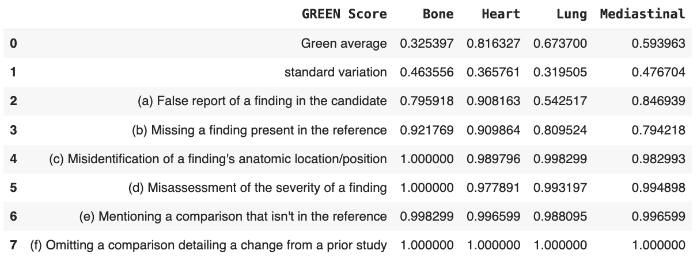

# ML-Quiz-XRay-ReportGeneration
Finetune a Multimodal Model for X-Ray Radiology Report Generation

This repository finetunes the LLaVA (Large Language and Vision Assistant) on IU X-Ray dataset. The `XRay-ReportGeneration.pdf` defines two Tasks:

- Task 1. Prompt engineering: reorganize the X-Ray report findings into predefined anatomical regions
- Task 2. Efficient Model Fine-tuning of LLaVA on the provided training set for report generation using parameter efficient fine-tuning methods (e.g., LoRA).


## Environments and Requirements

- [Google Colab](https://colab.research.google.com/)
- A100 GPU and 100 compute units

Setup and Install:

1. Mount to your google drive account
```setup
from google.colab import drive
drive.mount('/content/drive')
```

2. Load Quiz repo from Github with finetuned model checkpoints
```setup
!git clone https://github.com/Shen16/ML-Quiz-XRay-ReportGeneration.git
%cd ML-Quiz-XRay-ReportGeneration
```

3. Load `LLaVa` repo and install the repository in editable mode
```setup
!git clone https://github.com/haotian-liu/LLaVA.git
!cd LLaVA && pip install --upgrade pip && pip install -e .
```

4. Install flash attention and DeepSpeed
```setup
!cd LLaVA && pip install -e ".[train]"
!pip install flash-attn --no-build-isolation
!pip install deepspeed
```

5. Install other packages
```setup
!pip install -r requirements.txt
```


## Dataset

- Data was obtained from the [IU-X-ray](https://paperswithcode.com/dataset/iu-x-ray) datatset. 
- Download the raw dataset from this [link](https://drive.google.com/file/d/1lBEpxrmwBkgVTZGZ92mCu0qcoq58-yMI/view?usp=sharing)

## Preprocessing

Description of preprocessing method:
- `prompt.ipynb` notebook was used to generate the categorized reports on the validation split to complete Task 1. The output is saved in `annotation.json` file.
- Processed the dataset to create single image and report pairs for each patient. The `0.png` image was used only. 

*Note: Did not load multiple images for a single patient for GPU and memory limitations).*


Running the data preprocessing code:

1. Run the script to generate the report for Task 1. Get your OpenAI API token and replace `<openAI_API_key>` with it:
```python
!python prompt.py -i 'data/annotation_quiz_all.json' -o 'data/annotation.json' -k "<openAI_API_key>"
```
*Alternatively you can run the `prompt.ipynb` notebook in colab*

2. Generate image-report pairs for each patient and generate `dataset.json` file in the following structure for training:

```json
[
    {
        "id": "360691e3-610f-4d6d-9f71-99672524eb89",
        "image": "360691e3-610f-4d6d-9f71-99672524eb89.png",
        "conversations": [
            {
                "from": "human",
                "value": "Please describe the findings in the X-ray."
            },
            {
                "from": "gpt",
                "value": "<s_bone>Degenerative changes are present in the spine.</s_bone><s_heart>Heart size and pulmonary vascularity appear within normal limits.</s_heart><s_lung>Lungs are free of focal airspace disease. No pneumothorax or pleural effusion is seen.</s_lung><s_mediastinal></s_mediastinal><s_others>A large hiatal hernia is noted.</s_others>"
            }
        ]
    },
    {
        "id": "511d0a14-3b13-4814-8658-baf1c47b4188",
        "image": "511d0a14-3b13-4814-8658-baf1c47b4188.png",
        "conversations": [
            {
                "from": "human",
                "value": "Please describe the findings in the X-ray."
            },
            {
                "from": "gpt",
                "value": "<s_bone>Bony structures are intact.</s_bone><s_heart>Cardiac contours are within normal limits.</s_heart><s_lung>Lungs are clear.</s_lung><s_mediastinal>Mediastinal contours are within normal limits.</s_mediastinal><s_others></s_others>"
            }
        ]
    },

    ...
]
```

Each image is assigned a unique id. Organize the data as follows in `./ML-Quiz-XRay-ReportGeneration`:
```
├── dataset_train
│   └── images
│       └── 00a7a45c-af6e-4f5b-b305-595620ae4deb.png
│       └── ...
│   └── train
│       └── train_dataset.json
│ 
├── dataset_test
│   └── images
│       └── 00a7a45c-af6e-4f5b-b305-595620ae9ner.png
│       └── ...
│   └── test
│       └── test_dataset.json
│ 
├── dataset_val
    └── images
        └── 00a7a45c-af6e-4f5b-b305-595620ae0reb.png
        └── ...
    └── val
        └── val_dataset.json
```


Run this script to generate the files for each split:
```python
!python preprocess_data.py -s 'train'
!python preprocess_data.py -s 'val'
!python preprocess_data.py -s 'test'
```


## Training

To train the model, run this notebook in Google Colab:
```train
python finetune.ipynb
```

1. Set environment variable to reduce memory fragmentation issues
```
import os
os.environ['PYTORCH_CUDA_ALLOC_CONF'] = 'expandable_segments:True'
```

2. Run the train_mem.py script from LLaVA repo to finetune model. Used LoRa adapters for parameter efficient finetuning. Used liuhaotian/llava-v1.5-7b base model with 1 epoch (to stay within compute limit). Finetuned model weights saved to ./checkpoints/llava-v1.5-7b-task-lora folder.
```
!deepspeed LLaVA/llava/train/train_mem.py \
    --lora_enable True --lora_r 128 --lora_alpha 256 --mm_projector_lr 2e-5 \
    --deepspeed LLaVA/scripts/zero3.json \
    --model_name_or_path liuhaotian/llava-v1.5-7b \
    --version v1 \
    --data_path ./dataset_train/train/train_dataset.json \
    --image_folder ./dataset_train/images \
    --vision_tower openai/clip-vit-large-patch14-336 \
    --mm_projector_type mlp2x_gelu \
    --mm_vision_select_layer -2 \
    --mm_use_im_start_end False \
    --mm_use_im_patch_token False \
    --image_aspect_ratio pad \
    --group_by_modality_length True \
    --bf16 True \
    --output_dir ./checkpoints/llava-v1.5-7b-task-lora \
    --num_train_epochs 1 \
    --per_device_train_batch_size 16 \
    --per_device_eval_batch_size 4 \
    --gradient_accumulation_steps 1 \
    --evaluation_strategy "no" \
    --save_strategy "steps" \
    --save_steps 50000 \
    --save_total_limit 1 \
    --learning_rate 2e-4 \
    --weight_decay 0. \
    --warmup_ratio 0.03 \
    --lr_scheduler_type "cosine" \
    --logging_steps 1 \
    --tf32 True \
    --model_max_length 2048 \
    --gradient_checkpointing True \
    --dataloader_num_workers 4 \
    --lazy_preprocess True \
    --report_to tensorboard
```


## Trained Models

You can download trained model here:

1. Download the model checkpoint folder from the [zip file](https://drive.gogithubZipfile.git). 

2. To load the model excute the following code:
```python
#merge the LoRA weights with the full base model
!python LLaVA/scripts/merge_lora_weights.py --model-path checkpoints/llava-v1.5-7b-task-lora --model-base liuhaotian/llava-v1.5-7b --save-model-path llava-ftmodel
```
*Make sure the `llava-ftmodel` is in the `./ML-Quiz-XRay-ReportGeneration` directory.*


## Inference

1. To infer the testing cases, run the following code on a Test sample image:
```python
!python -m llava.serve.cli \
  --model-path llava-ftmodel \
  --image-file "/content/drive/My Drive/ML-Quiz-XRay-ReportGeneration/dataset_test/images/cf33da4a-49f3-4dd1-8e5b-038d2637751f.png"
```
*Note: Replace image id "cf33da4a-49f3-4dd1-8e5b-038d2637751f.png" with exisiting id*


2. Generate predictions on Test set:
```python
!python -m llava.eval.model_vqa_science \
    --model-path llava-ftmodel \
    --question-file ./dataset_test/test/test_dataset.json \
    --image-folder ./dataset_test/images \
    --answers-file ./dataset_test/answers/llava-v1ft.5-7b.jsonl \
    --single-pred-prompt \
    --temperature 0 \
    --conv-mode vicuna_v1
```

3. Generate predictions on Val set:
```python
!python -m llava.eval.model_vqa_science \
    --model-path llava-ftmodel \
    --question-file ./dataset_val/val/val_dataset.json \
    --image-folder ./dataset_val/images \
    --answers-file ./dataset_val/answers/llava-v1ft.5-7b.jsonl \
    --single-pred-prompt \
    --temperature 0 \
    --conv-mode vicuna_v1
```
*Note: Was not able to evalute on validation set as I exhausted my colab compute units (requires A100 GPU)*


## Evaluation

1. Clone the GREEN repo:
```python
!git clone https://github.com/Stanford-AIMI/GREEN.git
```

2. Install required packages. Restart kernel afterwards.:
```python
 # run and then restart kernel to use packages
%cd GREEN
!pip install -e . 
```

3. Import green3.py script which will save both GREEN summary and result dataframe:
```python
# import libraries
from src import green # import green.py
from src.green3 import compute # modified code (green3.py) to save both GREEN summary and result_df
```

4. To compute the GREEN evaluation metrics on test set, run the notebook:
```python
GREEN_eval.ipynb
```


## Results

Our method achieves the following performance on XRay-ReportGeneration:

| Index | GREEN Score                                                    |      Bone      |     Heart      |     Lung       | Mediastinal   |
|-------|----------------------------------------------------------------|:--------------:|:--------------:|:--------------:|:-------------:|
| 0     | Green average                                                  |  0.3253968254  |  0.8163265306  |  0.6737001944  | 0.5939625850  |
| 1     | Standard variation                                             |  0.4635559317  |  0.3657609376  |  0.3195053647  | 0.4767040097  |
| 2     | (a) False report of a finding in the candidate                 |  0.7959183673  |  0.9081632653  |  0.5425170068  | 0.8469387755  |
| 3     | (b) Missing a finding present in the reference                 |  0.9217687075  |  0.9098639456  |  0.8095238095  | 0.7942176871  |
| 4     | (c) Misidentification of a finding's anatomic location/position|  1.0000000000  |  0.9897959184  |  0.9982993197  | 0.9829931973  |
| 5     | (d) Misassessment of the severity of a finding                 |  1.0000000000  |  0.9778911565  |  0.9931972789  | 0.9948979592  |
| 6     | (e) Mentioning a comparison that isn't in the reference        |  0.9982993197  |  0.9965986395  |  0.9880952381  | 0.9965986395  |
| 7     | (f) Omitting a comparison detailing a change from a prior study|  1.0000000000  |  1.0000000000  |  1.0000000000  | 1.0000000000  |





## Acknowledgement

> We thank the contributors of public datasets. 

